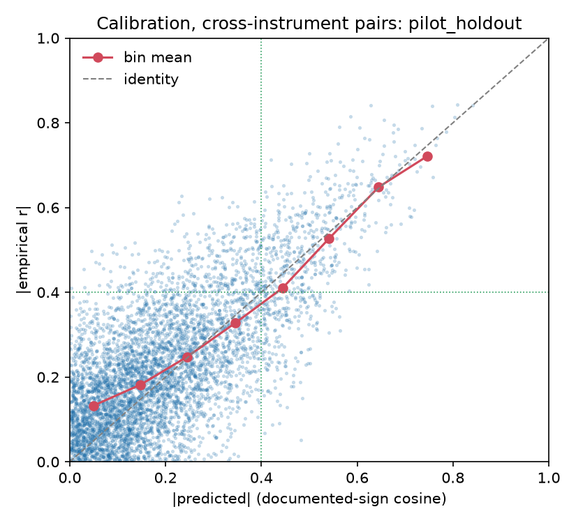
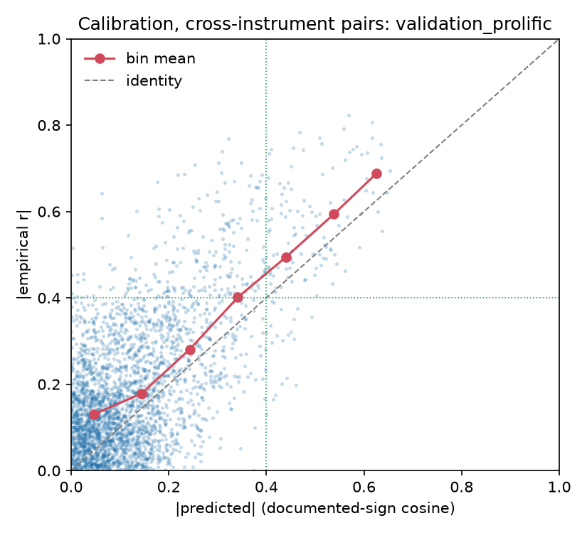

# Threshold-based evaluation of documented-sign pooling (variant B)

Cross-instrument scale pairs only (query and database scale from different instruments), from `scale_pair_predictions.csv`. Bootstrap intervals: 2000 resamples of scale pairs.

## pilot_holdout

5448 cross-instrument pairs among 113 scales.

### Precision and recall at display threshold t

| threshold | base_rate | n_flagged | n_related | n_both | precision_ci | recall_ci | sign_agreement_flagged |
|---|---|---|---|---|---|---|---|
| 0.30 | 0.298 | 1295 | 1622 | 956 | 0.74 [0.71, 0.76] | 0.59 [0.56, 0.61] | 0.998 |
| 0.40 | 0.152 | 657 | 826 | 453 | 0.69 [0.65, 0.72] | 0.55 [0.51, 0.58] | 1.000 |
| 0.50 | 0.068 | 269 | 371 | 187 | 0.70 [0.64, 0.75] | 0.50 [0.45, 0.55] | 1.000 |

### Calibration by |predicted| bin

| bin | n | mean_abs_empirical | median_abs_empirical | share_empirical_ge_40 |
|---|---|---|---|---|
| 0-.1 | 1561 | 0.133 | 0.117 | 0.010 |
| .1-.2 | 1536 | 0.182 | 0.176 | 0.036 |
| .2-.3 | 1056 | 0.248 | 0.244 | 0.111 |
| .3-.4 | 638 | 0.328 | 0.329 | 0.288 |
| .4-.5 | 388 | 0.411 | 0.413 | 0.549 |
| .5-.6 | 186 | 0.526 | 0.537 | 0.844 |
| .6-.7 | 63 | 0.648 | 0.651 | 1.000 |
| .7+ | 20 | 0.721 | 0.720 | 1.000 |

Precision at 5 by |cosine|, cross-instrument, queries with at least one related scale: 0.749 over 110 query scales.

## validation_prolific

2949 cross-instrument pairs among 80 scales.

### Precision and recall at display threshold t

| threshold | base_rate | n_flagged | n_related | n_both | precision_ci | recall_ci | sign_agreement_flagged |
|---|---|---|---|---|---|---|---|
| 0.30 | 0.226 | 288 | 667 | 234 | 0.81 [0.77, 0.86] | 0.35 [0.31, 0.39] | 1.000 |
| 0.40 | 0.113 | 124 | 332 | 106 | 0.85 [0.79, 0.91] | 0.32 [0.27, 0.37] | 1.000 |
| 0.50 | 0.055 | 47 | 162 | 39 | 0.83 [0.71, 0.93] | 0.24 [0.18, 0.31] | 1.000 |

### Calibration by |predicted| bin

| bin | n | mean_abs_empirical | median_abs_empirical | share_empirical_ge_40 |
|---|---|---|---|---|
| 0-.1 | 1472 | 0.131 | 0.111 | 0.014 |
| .1-.2 | 850 | 0.178 | 0.159 | 0.056 |
| .2-.3 | 339 | 0.281 | 0.278 | 0.206 |
| .3-.4 | 164 | 0.402 | 0.410 | 0.530 |
| .4-.5 | 77 | 0.494 | 0.493 | 0.766 |
| .5-.6 | 35 | 0.594 | 0.568 | 1.000 |
| .6-.7 | 12 | 0.688 | 0.685 | 1.000 |

Precision at 5 by |cosine|, cross-instrument, queries with at least one related scale: 0.673 over 52 query scales.

